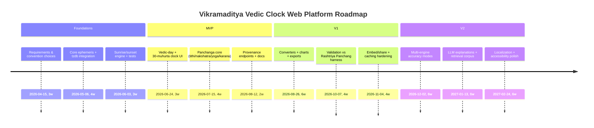

# Vikramaditya Vedic Clock: Historical Foundations, Astronomical Parameters, and a Build Blueprint for a Web Platform

## Executive summary

The Vikramaditya Vedic Clock is a contemporary public-facing “time display + educational system” that re-centers **Indian traditional time-reckoning (kāla-gaṇanā)** around (a) **sunrise as the day-boundary**, and (b) **Pañcāṅga-style astronomical parameters** (tithi, nakṣatra, etc.) rather than only the civil 24-hour clock. In 2024, the Government of India’s press communication around the initiative framed it as “the world’s first” such clock and explicitly connected it to Ujjain’s historical reputation as a reference point for time calculation. citeturn61search0turn61search4

Conceptually, the clock is best understood as a layered mapping from **astronomical state vectors** (Sun/Moon positions; Earth rotation; observer location) into multiple “time narratives” (civil time, local mean solar time, sunrise-based day, muhūrta/ghaṭī units, and Pañcāṅga elements). The underlying shāstric vocabulary for these mappings is not “one thing”: Sanskrit sources define multiple time scales (mūrta/amūrta; prāṇa/nāḍikā; savana day; lunar tithi) and even include computational rules for tithi, yoga, and karaṇa in terms of solar/lunar longitudes. citeturn33view0turn49view1turn35view2

For implementation, a robust system requires: (1) an ephemeris engine (Sun/Moon geocentric longitudes, plus ayanāṃśa); (2) a sunrise/sunset engine (topocentric solar altitude crossing, typically including standard refraction); (3) a time-scale pipeline (UTC ↔ TT/UT1, ΔT handling, time zones/DST); and (4) deterministic definitions of Pañcāṅga elements (tithi/nakṣatra/yoga/karaṇa) and Vedic units (muhūrta, ghaṭī, etc.). NOAA publishes clear reference equations for sunrise/sunset and equation-of-time style calculations; the entity["company","Astrodienst AG","swiss ephemeris publisher"] Swiss Ephemeris documentation is a high-value reference for sidereal standards (including Lahiri ayanāṃśa’s institutionalization and reproduction guidance). citeturn53view0turn53view1turn55view0

A web platform built around the clock can go beyond “display” into: bidirectional converters (civil↔muhūrta/ghaṭī), location-aware Pañcāṅga calculators, educational explainers with provenance, embed/share tools, and verified outputs cross-checked against Indian government almanacs (e.g., Rashtriya Panchang) and modern ephemerides (e.g., JPL DE440). India’s entity["organization","India Meteorological Department","new delhi, india"] entity["organization","Positional Astronomy Centre","kolkata, india"] explicitly state that Rashtriya Panchang is computed on modern scientific principles and serves as a standardized source for calendric data—making it a practical validation target. citeturn38search1turn38search3

*Note on connector use:* I searched the enabled Notion connector first, but it did not contain relevant internal notes on the Vikramaditya Vedic Clock beyond unrelated material; the report therefore relies on primary/public sources.

## What the Vikramaditya Vedic Clock is

A modern, state-backed “heritage + technology” artifact, the Vikramaditya Vedic Clock has been publicly described in two complementary deployments:

- A major installation in entity["city","Ujjain","madhya pradesh, india"] (entity["state","Madhya Pradesh","india state"]), associated with the city’s historic status in Indian astronomical geography; the Prime Minister entity["politician","Narendra Modi","prime minister of india"] referenced it in 2024 as part of Madhya Pradesh’s Vikramotsav framing and described the government as having “reestablished” the world’s first Vikramaditya Vedic Clock there. citeturn61search0  
- A temple-complex installation at entity["point_of_interest","Kashi Vishwanath Dham","varanasi, india"], described as a heavy clock displaying (among other items) “Local Mean Time,” “tithi,” and “nakshatra,” and explicitly using a sunrise-based day and 30 muhūrta divisions. The report notes it was presented in the presence of entity["politician","Yogi Adityanath","uttar pradesh chief minister"] and gifted by entity["politician","Mohan Yadav","madhya pradesh chief minister"]. citeturn56view1

A recurring public description is that the clock “flips” the day boundary from midnight to sunrise and divides the day into **30 muhūrtas (~48 minutes each)**, while also displaying Pañcāṅga elements and (in some descriptions) showing both IST and GMT side-by-side. citeturn56view1turn61search4

### Why Ujjain matters in this framing

The Ujjain deployment is commonly situated near entity["point_of_interest","Jantar Mantar, Ujjain","ujjain, madhya pradesh, india"] / Vedh Shala heritage instruments, which are themselves historically designed for naked-eye astronomical measurement and time determination. Modern interpretive sources on the observatories emphasize that Ujjain was chosen by Jai Singh’s program partly because it lies on a prime meridian used in ancient Hindu canons of astronomy, making it symbolically apt for a “time reference” narrative. citeturn45search0

image_group{"layout":"carousel","aspect_ratio":"16:9","query":["Vikramaditya Vedic Clock Ujjain","Jantar Mantar Ujjain Vedh Shala sundial"],"num_per_query":1}

## Textual genealogy, key people, and modern scholarship

### Key historical actors and institutions in the “time reckoning” lineage

The “Vedic clock” idea draws from an Indian astronomical and calendrical continuum that includes:

- entity["people","Vikramaditya","legendary indian king"] as the symbolic namesake used in modern branding (not a single, universally pinned historical individual across all traditions, but central to “Vikram” cultural framing). citeturn61search0  
- entity["people","Jai Singh II","jaipur maharaja"], builder of the 18th-century masonry observatories (Jantar Mantars), including Ujjain’s site, which historically functioned as an observational time/astronomy complex. citeturn45search0turn45search2  
- The mid-20th-century national standardization effort: the entity["organization","Indian Calendar Reform Committee","government of india 1955"], chaired by entity["people","M. N. Saha","physicist calendar reform"] with entity["people","N. C. Lahiri","astronomer lahiri ayanamsha"] serving as secretary, created a formal “scientific basis” push for Indian calendrical uniformity. citeturn40view0turn42view0turn42view1  
- The committee was constituted under the entity["organization","Council of Scientific and Industrial Research","india research council"] umbrella and explicitly framed its goal as proposing an “accurate and uniform calendar” based on scientific study. citeturn42view1turn40view0

### Primary Sanskrit sources relevant to a “Vedic clock” computation model

A computationally meaningful Vedic-clock implementation (as opposed to purely symbolic clock-face design) is anchored in Sanskrit sources that actually define time units and/or provide computation rules:

- entity["book","Sūryasiddhānta","sanskrit astronomy treatise"]: defines time as mūrta/amūrta, specifies prāṇa/truṭi/nāḍikā-type units, defines savana day as sunrise-to-sunrise, and includes computational rules for yoga/tithi/karaṇa in terms of solar/lunar longitudes. citeturn33view0turn49view1  
- entity["book","Manusmṛti","dharmaśāstra text"]: provides an explicit micro-to-macro unit chain (nimeṣa → kāṣṭhā → kalā → muhūrta → ahorātra). citeturn35view2turn34search2  
- entity["book","Vedāṅga Jyotiṣa","jyotiṣa vedāṅga text"], traditionally attributed to entity["people","Lagadha","vedic jyotisha author"]: commonly treated in modern scholarship as the earliest extant systematic Indian calendrical astronomy text, foundational for nakṣatra/tithi-oriented calendrical logic. citeturn19search36turn17search1  
- Astronomical siddhānta lineage texts shaping later computational practice: entity["people","Āryabhaṭa","indian mathematician"]’s entity["book","Āryabhaṭīya","classical astronomy text"]; entity["people","Varāhamihira","indian astronomer"]’s entity["book","Pañcasiddhāntikā","sanskrit astronomy compendium"]; entity["people","Brahmagupta","indian mathematician"]’s entity["book","Khaṇḍakhādyaka","sanskrit astronomy text"]; and entity["people","Bhāskara II","indian mathematician"]’s entity["book","Siddhānta Śiromaṇi","sanskrit astronomy treatise"]. (These are relevant because modern Pañcāṅga computation typically descends from siddhānta-ganita traditions, even when implemented with modern ephemerides.) citeturn40view0turn55view0  
- Sidereal-zero discussions in later practical astronomy (important for ayanāṃśa choices): entity["book","Grahālaghava","ganesha daivajña text"] is explicitly cited in Swiss Ephemeris documentation as part of the cultural history around Spica/Citra-based sidereal orientation and calendar-maker practice. citeturn55view0

### Modern scholarship and modern public intellectual discourse

Serious modern historiography of Indian astronomy is strongly associated with scholars such as entity["people","David Pingree","historian of science"] and entity["people","Kim Plofker","historian of math"]; the latter’s work emphasizes the tight coupling between mathematics and astronomy in Sanskrit textual cultures and treats the field as a coherent discipline grounded in Sanskrit sources rather than isolated “fun facts.” citeturn47search3turn47search0

The “Vedic knowledge systems” public-education ecosystem is broader than formal academia. The user-specified author entity["people","Ami Ganatra","indian author"] is positioned publicly as a student of Sanskrit and Indian knowledge systems and has spoken on relevance of epics and Indic frameworks (which is relevant if your web platform includes interpretive layers around time-reckoning and dharma calendars). citeturn60view0

## Vectors and parameters that constitute the “clock”

A Vikramaditya-style Vedic clock is not one scalar; it is a function:

\[
\text{Display}(t_\text{civil}, \phi,\lambda,\text{tz},\text{calendar/ayanāṃśa conventions},\text{ephemeris model}) \rightarrow \{\text{civil time},\text{sunrise-day time}, \text{pañcāṅga}, \text{units}\}
\]

Below is a rigorous parameter inventory. (When traditions diverge, you must choose conventions explicitly, expose them in UI, and attach provenance.)

### Core observer & civil-time vectors

| Vector / parameter | Definition | Why it matters |
|---|---|---|
| Latitude (φ), Longitude (λ), Elevation (h) | Geographic coordinates of the observer | Sunrise/sunset are topocentric; longitudes affect local mean solar time; elevation affects horizon geometry/refraction assumptions. citeturn53view0turn53view1 |
| Time zone (IANA tzid) | Civil zone rules (offset history + DST rules) for a location | Needed to map UTC ↔ local civil time; rules can change with little notice and are tracked in tzdb. citeturn58search0 |
| DST flag / transitions | Seasonal clock shifts | Must be computed from tzdb rules, not hard-coded. citeturn58search0 |
| Civil timescale | UTC (or local), plus conversion to TT/TDB as needed | High-precision ephemerides are typically evaluated in TT/TDB; sunrise uses Earth-rotation-related measures; leap seconds and ΔT handling matter. citeturn58search5turn59search8turn53view0 |
| UT1−UTC, leap seconds | Earth rotation irregularity corrections | If you care about sub-minute fidelity across decades, you want UT1 and ΔT; IERS maintains conventions and reference models. citeturn58search5 |

### Astronomical state vectors required for Pañcāṅga and related displays

| Vector / parameter | Mathematical object | Notes |
|---|---|---|
| Sun apparent geocentric ecliptic longitude, λ☉ | λ☉(t) | Needed for tithi (elongation), yoga (sum), saṅkrānti (solar ingress), and visible solar geometry. citeturn49view1turn59search8 |
| Moon apparent geocentric ecliptic longitude, λ☾ | λ☾(t) | Needed for tithi, nakṣatra, yoga, karaṇa, lunar phase, eclipses. citeturn49view1turn59search8 |
| True lunar elongation | Δλ = wrap(λ☾ − λ☉) | Basis of tithi boundaries (12° steps). citeturn49view1 |
| Sidereal longitudes | λ_sid = λ_trop − ayanāṃśa(t) | Nakṣatra and rāśi in nirayana systems depend on ayanāṃśa. citeturn55view0 |
| Ayanāṃśa choice and reference epoch | lahiri (citra/spica), etc. | Lahiri (Citra/Spica tradition) was institutionalized in India’s calendar reform; Swiss Ephemeris documents exact reproduction targets and context. citeturn55view0 |
| Precession-nutation model | IAU/IERS standard model | If you implement your own positions (rather than using a library), choose a standard; IERS Conventions provide reference. citeturn58search5 |

### “Vedic time unit” parameters and their definitions

These units appear in multiple textual lines; two highly relevant chains are:

- **Sūryasiddhānta**: defines mūrta/amūrta, with prāṇa/truṭi and nāḍikā-family units; 60 nāḍikās make a nakṣatra ahorātra; 30 such make a savana month; it also defines the savana day explicitly as sunrise-to-sunrise. citeturn33view0  
- **Manusmṛti 1.64**: 18 nimeṣas = 1 kāṣṭhā; 30 kāṣṭhās = 1 kalā; 30 kalās = 1 muhūrta; 30 muhūrtas = 1 day+night (ahorātra). citeturn35view2turn34search2

Operationally (for a web clock), the most common “clock-face” units are:

| Unit | Common modern approximation | Textual grounding / notes |
|---|---:|---|
| nimeṣa | blink-scale | Manusmṛti gives explicit chaining from nimeṣa upward. citeturn35view2turn34search2 |
| muhūrta | 48 minutes (when mapping 30 per 24h) | Public descriptions of the Vikramaditya-style clock explicitly use 30 muhūrtas of ~48 min each. citeturn56view1turn61search4 |
| ghaṭī / nāḍikā | 24 minutes (60 per 24h) | Sūryasiddhānta defines nāḍikā structure and 60-unit day partitions within its system. citeturn33view0 |
| prahara | quarter-day segment (often 4 day + 4 night) | This is a user-facing “division of day/night” concept you can include; implement as either fixed civil partitions or sunrise/sunset-based partitions (convention must be declared). (Textual variability is significant; treat as convention-driven.) citeturn38search6turn40view0 |

### Pañcāṅga elements and related parameters

The minimum Pañcāṅga “five limbs” are: vāra (weekday), tithi, nakṣatra, yoga, karaṇa; modern clock descriptions explicitly include at least tithi and nakṣatra. citeturn56view1turn61search4

| Element | Definition in computation terms | Source grounding |
|---|---|---|
| tithi | function of (λ☾ − λ☉), partitioned into 30 segments per synodic cycle (12° each in the modern standard algorithm) | Sūryasiddhānta includes a direct rule for tithi from lunar–solar longitude difference. citeturn49view1 |
| yoga | function of (λ☉ + λ☾), partitioned into 27 parts (13°20′ each) | Sūryasiddhānta gives a direct rule for yoga from combined longitudes. citeturn49view1 |
| karaṇa | half-tithi; 60 segments; with recurring + fixed karaṇas | Sūryasiddhānta includes rules distinguishing fixed and “movable” karaṇas and their repetition. citeturn49view1 |
| nakṣatra | lunar sidereal longitude segmented into 27 | The clock’s public descriptions emphasize nakṣatra display; implement as sidereal segmentation using your ayanāṃśa definition. citeturn56view1turn55view0 |

## Algorithms and formulas to convert between Vedic units and modern time

This section is written so you can translate it directly into code, while keeping definitional provenance explicit.

### Civil time pipeline (what you should store internally)

**Recommendation:** store instants in **UTC** (or a monotonic internal timescale), attach a tzid, and compute derived values deterministically using tzdb rules. IANA explicitly notes that governments control these rules and may change them with little notice, which is why tzdb exists and is updated periodically. citeturn58search0

### Sunrise/sunset and solar noon

A practical, well-cited baseline is NOAA’s published equations (which themselves state they are based on established astronomical algorithms). citeturn51search0turn53view0turn53view1

Key pieces (NOAA):

- fractional year \(\gamma\), equation of time (eqtime, minutes), and solar declination (decl) are computed from the day-of-year and time; then solar hour angle and zenith are used to compute sunrise/sunset. citeturn53view0turn53view1  
- for sunrise/sunset: zenith is set to **90.833°** to approximate refraction + solar disk, and then:

\[
ha = \pm \arccos\left(\frac{\cos 90.833^\circ}{\cos\phi\cos\delta}-\tan\phi\tan\delta\right)
\]
\[
\text{sunrise}_\text{UTC-min} = 720 - 4(\lambda + ha) - eqtime
\]
\[
\text{solar-noon}_\text{UTC-min} = 720 - 4\lambda - eqtime
\]

with longitude positive east. citeturn53view1turn53view0

### Mapping to “Vedic day” (sunrise anchored) and “30 muhūrta clock”

Public descriptions of this clock paradigm use: “day starts at sunrise, ends at next sunrise,” and divide the day into 30 muhūrtas (~48 minutes). citeturn56view1turn61search4

Define:

- \(S_d\) = sunrise instant for the current civil date at location (local timezone-aware computation)
- \(S_{d+1}\) = next sunrise instant
- \(t\) = an instant you want to display

Then:

**Vedic-day membership**  
If \(t < S_d\), treat it as belonging to the previous sunrise-day (compute \(S_{d-1}\) instead). This is the essential “date changes at sunrise” behavior described in clock narratives. citeturn56view1turn33view0

**Two implementation choices (you must pick and disclose):**

1) **Fixed muhūrta length (48 min)**: matches public descriptions (30×48=24h).  
   - muhurta_index = floor( minutes_since_Sunrise / 48 ) in [0..29]  
   - muhurta_fraction = (minutes_since_Sunrise % 48) / 48  

2) **Variable muhūrta length (astronomical day partition)**: 30 equal parts of the sunrise-to-sunrise interval:  
   - muhurta_len = (S_{d+1} − S_d) / 30  
   - muhurta_index = floor( (t − S_d)/muhurta_len )  

Choice (1) aligns with the headline public communication; choice (2) aligns more strictly to “between two sunrises” as an interval partition. The platform can allow “mode switch” with an explanation panel (and it should, because users will ask why sunrise-to-sunrise is not always exactly 24h due to equation-of-time and Earth rotation irregularities). citeturn53view0turn58search5

### Pañcāṅga elements: precise computational definitions

#### Tithi

Sūryasiddhānta gives a direct computational relationship: tithi is derived from the difference between lunar and solar longitudes divided by the “bhoga” partition (in classical terms of liptā and arc measures). citeturn49view1

Modern computational expression (standard, library-friendly form):

- Let Δλ = wrapTo360(λ☾ − λ☉)
- tithi_number = floor(Δλ / 12°) + 1  (1..30)
- current tithi ends at the next time \(t\) where Δλ crosses a multiple of 12°.

Boundary-finding is done by root-finding (bisection / secant) on:
\[
f(t) = \text{wrapTo360}(\lambda_\moon(t) - \lambda_\sun(t)) - 12^\circ \cdot k
\]
for integer \(k\) bracketing the current segment.

#### Yoga

Sūryasiddhānta gives a direct rule: yoga from the combined solar-lunar longitude and division by the nakṣatra-arc. citeturn49view1

Modern expression:

- Use **sidereal** longitudes if following nirayana conventions:  
  λ☉_sid = wrapTo360(λ☉_trop − ayanāṃśa)  
  λ☾_sid = wrapTo360(λ☾_trop − ayanāṃśa)
- sum = wrapTo360(λ☉_sid + λ☾_sid)
- yoga_number = floor(sum / 13°20′) + 1 (1..27)

Yoga end time is the next boundary crossing of sum at multiples of 13°20′.

#### Karaṇa

Sūryasiddhānta distinguishes fixed karaṇas and recurring (“movable”) karaṇas, and states that one should compute karaṇa based on **half-tithi bhoga**. citeturn49view1

Modern expression:

- karaṇa_index = floor(Δλ / 6°)  (0..59)
- Map index to name using the traditional sequence (Kimstughna first half of śukla pratipadā; then the 7 movable repeat; then the fixed at the end). The key is deterministic mapping; expose your mapping table in documentation and tests. citeturn49view1

#### Nakṣatra

Implementation requires a declared sidereal convention (ayanāṃśa). Swiss Ephemeris gives a richly documented discussion of Lahiri/Spica-Citra tradition and its adoption through India’s calendar reform process. citeturn55view0turn42view1

Modern expression:

- nakshatra_number = floor( wrapTo360(λ☾_sid) / 13°20′ ) + 1 (1..27)

Boundary is the next time λ☾_sid crosses a multiple of 13°20′.

### Ayanāṃśa calculation options (and what to ship)

You have two realistic choices for production:

1) **Library-defined ayanāṃśa**, e.g., Lahiri as implemented by Swiss Ephemeris (recommended for most “clock” products). Swiss Ephemeris explicitly documents Lahiri ayanāṃśa’s standardization via India’s Calendar Reform Committee and provides numeric reproduction anchors. citeturn55view0  
2) **Roll-your-own precession model** (IAU/IERS), then define a fiducial star alignment. This is higher effort and easier to get subtly wrong; if you do it, cite IERS Conventions as your model authority. citeturn58search5

### Sample pseudocode (deterministic, testable)

```pseudo
function computeVedicClock(datetime_utc, lat, lon, tzid, ayanamsha_mode):
    local = convert_utc_to_local(datetime_utc, tzid)  # tzdb-based

    sunrise_today = sunrise(local.date, lat, lon, tzid)        # NOAA or ephemeris-based
    if local < sunrise_today:
        sunrise_today = sunrise(local.date - 1 day, lat, lon, tzid)

    sunrise_next = sunrise(date_of(sunrise_today) + 1 day, lat, lon, tzid)

    # Muhurta clock mode A: fixed 48-minute muhurtas
    minutes_from_sunrise = (local - sunrise_today).total_minutes()
    muhurta_index = floor(minutes_from_sunrise / 48)  # 0..29
    muhurta_minute = minutes_from_sunrise % 48

    # Ephemeris
    tt = utc_to_tt(datetime_utc)  # needs leap seconds + ΔT model
    lambda_sun_trop = solar_ecliptic_longitude(tt)
    lambda_moon_trop = lunar_ecliptic_longitude(tt)

    ayan = ayanamsha(tt, mode=ayanamsha_mode)  # e.g., Lahiri
    lambda_sun_sid = wrap360(lambda_sun_trop - ayan)
    lambda_moon_sid = wrap360(lambda_moon_trop - ayan)

    elong = wrap360(lambda_moon_trop - lambda_sun_trop)
    tithi = floor(elong / 12.0) + 1

    yoga_sum = wrap360(lambda_sun_sid + lambda_moon_sid)
    yoga = floor(yoga_sum / (13 + 20/60)) + 1

    nakshatra = floor(lambda_moon_sid / (13 + 20/60)) + 1

    karana_half = floor(elong / 6.0)  # 0..59
    karana_name = map_karana(karana_half)

    return {
        "sunrise_day_start": sunrise_today,
        "sunrise_day_end": sunrise_next,
        "muhurta_index": muhurta_index,
        "muhurta_minute": muhurta_minute,
        "tithi": tithi,
        "nakshatra": nakshatra,
        "yoga": yoga,
        "karana": karana_name
    }
```

## Data sources, APIs, and datasets to use

### Priority order (recommended)

**Tier A: authoritative ephemeris + official time/rotation + official zone rules**

1) entity["organization","NASA","us space agency"] / entity["organization","Jet Propulsion Laboratory","solar system dynamics"] ephemerides (DE440/DE441) via JPL Solar System Dynamics export pages and/or Horizons: JPL describes DE440 as the latest with fully consistent treatment of planetary + lunar laser ranging, and explains DE441 as a long-span integration variant; JPL also announces operational transitions (e.g., Horizons moving from DE430/431 to DE440/441). citeturn59search8turn59search2  
2) entity["organization","International Earth Rotation and Reference Systems Service","earth rotation service"] conventions/models: IERS Technical Note 36 (Conventions 2010) is the standard reference point for Earth orientation/time-system modeling in many precision contexts. citeturn58search5  
3) entity["organization","Internet Assigned Numbers Authority","time zone database authority"] tz database (tzdb): the public-domain time zone dataset used broadly across operating systems; it explicitly documents governmental control and change volatility. citeturn58search0  

**Tier B: validated “developer-grade” astronomy engines**

4) Swiss Ephemeris (Astrodienst) for planetary positions + ayanāṃśa options; it also documents how to reproduce values used in Indian Astronomical Ephemeris / Rashtriya Panchang contexts. citeturn55view0  
5) NOAA solar algorithms for sunrise/sunset and equation-of-time baseline (good for many product needs, and clearly specified). citeturn53view0turn53view1  

**Tier C: official Indian almanac outputs for reference/verification**

6) IMD/PAC publications: Rashtriya Panchang is explicitly described as standardized and computed on modern scientific principles, listing tithi/nakṣatra/yoga and nirayana transits alongside rise/set times (excellent for validation). citeturn38search1turn38search3  

### Comparison table: ephemeris and sunrise engines

| Option | Strengths | Risks / tradeoffs | Best use |
|---|---|---|---|
| JPL DE440/441 | Highest-grade modern ephemerides; official JPL description and update notices | Implementation complexity; you’ll usually use libraries to consume | “Gold” accuracy mode, archival computation, long-range integrity citeturn59search8turn59search2 |
| Swiss Ephemeris | Very developer-friendly; strong documentation on sidereal/ayanāṃśa and comparisons | Licensing constraints may apply for some commercial uses; must review terms | Production default for astrology/calendar apps citeturn54view0turn55view0 |
| NOAA sunrise equations | Clear formulas; quick; generally minute-level | NOAA itself notes calculator is not certified and can vary due to atmosphere; limited extreme latitudes | Practical sunrise/sunset display, baseline computations citeturn51search0turn53view1 |
| IMD Rashtriya Panchang outputs | Government-generated standardized almanac reference | Not an API; may require scraping / manual datasets; limited locations in some tables | Validation and regression testing anchor citeturn38search1turn38search3 |

## Web application architecture for a “Vedic clock + action platform”

### Architectural goals

A Vedic clock platform must be:

- **Deterministic** (same inputs → same outputs; versioned conventions)
- **Explainable** (what is being computed and why; provenance shown)
- **Scalable** (many users asking “now” queries by location)
- **Auditable** (able to reproduce past answers—critical for calendrical trust)

### Recommended system decomposition

**Core services**

1) **Computation service (stateless, versioned)**  
   - endpoints compute: sunrise/sunset; muhurta clock; pañcāṅga; conversions  
   - runs in a container with pinned ephemeris/tzdb versions  
2) **Data/cache service**  
   - caches expensive computations (e.g., sunrise tables per lat/lon/day; tithi boundary intervals)  
3) **Provenance registry**  
   - records algorithm version, ephemeris version (e.g., DE440 vs DE441), tzdb version, ayanāṃśa convention, refraction constant, etc.  
4) **Explanation service (LLM + retrieval)**  
   - generates human explanations tied to the exact computation provenance  
   - retrieval corpus should include (a) Sanskrit verses and translations you license/host, (b) curated expository notes, (c) “how we compute” docs with citations.

### API design examples (sample)

```http
GET /api/v1/vedic-clock/now?lat=25.3176&lon=82.9739&tz=Asia/Kolkata&ayanamsha=lahiri
```

Example JSON response:

```json
{
  "input": {
    "timestamp_utc": "2026-04-08T12:00:00Z",
    "location": { "lat": 25.3176, "lon": 82.9739, "elev_m": 80 },
    "tzid": "Asia/Kolkata",
    "conventions": {
      "ayanamsha": "lahiri",
      "muhurta_mode": "fixed_48min",
      "sunrise_model": "noaa_90.833"
    }
  },
  "output": {
    "civil_time_local": "2026-04-08T17:30:00+05:30",
    "sunrise_local": "2026-04-08T05:52:14+05:30",
    "sunset_local": "2026-04-08T18:23:09+05:30",
    "vedic_day": {
      "starts_at_sunrise": true,
      "day_start_local": "2026-04-08T05:52:14+05:30",
      "day_end_local": "2026-04-09T05:51:41+05:30"
    },
    "vedic_clock": {
      "muhurta_index": 14,
      "muhurta_elapsed_min": 10
    },
    "panchanga": {
      "tithi": { "number": 12, "name": "Shukla Dvadashi", "ends_at_local": "2026-04-08T21:18:03+05:30" },
      "nakshatra": { "number": 18, "name": "Jyeshtha", "ends_at_local": "2026-04-08T19:44:50+05:30" },
      "yoga": { "number": 6, "name": "Siddhi", "ends_at_local": "2026-04-08T16:12:09+05:30" },
      "karana": { "name": "Taitila", "ends_at_local": "2026-04-08T09:34:12+05:30" }
    }
  },
  "provenance": {
    "ephemeris": "DE440",
    "tzdb_version": "2026a",
    "code_version": "vedicclock-1.3.0"
  }
}
```

### Security, scalability, and caching notes

- Apply OWASP guidance for API security: authorization, authentication, rate limits, and inventory/version management are repeatedly highlighted as top risks in modern API systems. citeturn57search1turn57search2  
- Cache strategy:  
  - **sunrise/sunset** cache keyed by (lat, lon rounded, date, model)  
  - **tithi/yoga boundary** cache keyed by (date range, ayanāṃśa, ephemeris)  
- Offline computation: ship an “ephemeris pack” and tzdb snapshot as part of a compute image; expose a provenance endpoint so clients can see exactly what was used.

### Tech stack options and tradeoffs

| Stack | Pros | Cons | When to choose |
|---|---|---|---|
| Python (FastAPI) + Skyfield/SwissEphem | Fast iteration; strong science libs | Need performance tuning for high QPS; licensing review for SwissEphem | Research-to-production path, correctness first citeturn55view0turn59search8 |
| Node.js (NestJS) + WASM ephemeris module | Great web-native ecosystem | Harder to implement high-precision astro from scratch | Product-heavy teams, UI-first |
| Rust (Axum) + SPICE bindings | High performance, deterministic | Higher dev cost; fewer contributors | “Compute engine as product” at scale |

## UI/UX actions users can perform with the clock

A Vikramaditya-style clock is most compelling when users can *do* things:

### High-value interactive features

- **Live clock face**: toggle between civil 24h and “30 muhūrta” face; optionally show both, as public descriptions often do (IST/GMT alongside sunrise-based reckoning). citeturn56view1turn61search4  
- **Explain-this-now panel**: user clicks “tithi” and gets: definition, boundary times, and the exact input longitudes used; include Sanskrit verse references where possible (e.g., Sūryasiddhānta rules for tithi/yoga/karaṇa). citeturn49view1  
- **Converters**:  
  - civil time ↔ muhūrta/ghaṭī/nāḍikā  
  - “festival calculator”: find next occurrence of a given tithi+nakṣatra combination in a location  
- **Personalized charts** by date/time/location:  
  - show sunrise-to-sunrise day; show when each muhūrta starts; show tithi change instants  
- **Provenance & confidence**: a “calculation details” drawer listing: ephemeris (DE440 vs Swiss), ayanāṃśa, tzdb version, sunrise model (90.833° refraction), and expected accuracy bands (e.g., NOAA states typical sunrise/sunset results are theoretically within ~1 minute between ±72° latitude, with atmospheric variability caveats). citeturn51search0turn53view1  
- **Export/share/embed**:  
  - generate PNG/SVG embed of “today’s Vedic clock for my city”  
  - JSON export for developers  
- **Accessibility & education mode**: structured reading path explaining why India historically ties calendrical observance to tithi/nakṣatra and sunrise-day boundaries; include the Calendar Reform Committee story as “modern standardization layer.” citeturn42view1turn61search0

## Verification, provenance, licensing, ethics, and roadmap

### Testing, validation, and verification plan

You need a two-axis test strategy: (A) astronomical correctness; (B) calendrical convention correctness.

**Astronomical correctness**

- Unit tests against NOAA reference equations for sunrise/sunset and equation-of-time components (regression on known sample dates/locations). citeturn53view0turn53view1  
- Ephemeris cross-check: compare Sun/Moon longitudes computed via your primary engine against an independent engine (e.g., Swiss Ephemeris vs JPL-based pipeline). JPL documents DE440/DE441 and their intended usage; use those as the “truth anchor” in your high-accuracy mode. citeturn59search8turn55view0  

**Calendrical convention correctness**

- Golden-reference comparison against IMD/PAC Rashtriya Panchang outputs (tithi/nakṣatra/yoga, sunrise/sunset in included cities) because IMD positions it as standardized and scientifically computed. citeturn38search1turn38search3  
- Boundary tests: verify tithi/yoga/karaṇa change instants by root-finding convergence and ensure continuity across 0/360 wrap points; ensure mapping tables for karaṇa match Sūryasiddhānta’s fixed/movable description. citeturn49view1  

### Documentation and provenance requirements

Your platform should publish a “How we compute” spec that includes:

- Sanskrit-source anchors (e.g., Sūryasiddhānta verses defining the savana day and giving tithi/yoga/karaṇa computation rules; Manusmṛti time units). citeturn33view0turn49view1turn35view2  
- Convention registry versioning (ayanāṃśa choice; Lahiri’s institutionalization context; sunrise refraction constant). citeturn55view0turn53view1  
- Data provenance: ephemeris edition (DE440 vs DE441) and why (JPL explains DE441’s long-span tradeoff). citeturn59search8turn59search2  
- Timekeeping provenance: tzdb version and why it matters (government-controlled change). citeturn58search0  

### Licensing and cultural considerations

- **Ephemeris licensing:** Swiss Ephemeris has explicit licensing terms; validate commercial use conditions early. citeturn54view0  
- **Text licensing:** use public-domain Sanskrit e-text repositories where allowed (e.g., GRETIL provides reference e-texts with usage notes), but still track per-text terms. citeturn32search0turn34search0  
- **Cultural framing:** avoid “this proves 20–23% more accurate predictions” type claims unless you can publish methodology and evidence; keep the platform honest by labeling what is astronomical fact (positions, partitions) vs interpretive/astrological assertions. (Some media reports include such claims; treat them as non-validated promotional statements unless independently substantiated.) citeturn56view1  

### Implementation roadmap with milestones, effort, and cost ranges

Assumptions: budget unspecified; locale/timezone of end-users unspecified; web platform intended for global users; cost ranges depend heavily on whether you license Swiss Ephemeris commercially and on the desired accuracy mode.

**Estimated effort bands (typical product team)**  
- MVP (clock + sunrise-day + basic pañcāṅga + provenance): 6–10 weeks  
- V1 (full converters, charts, exports, validation harness vs Rashtriya Panchang): 3–5 months  
- V2 (multi-engine accuracy modes, explainers + LLM retrieval, localization): 6–9 months

**Indicative cost ranges (rough, not budget-constrained):**  
- MVP: USD 25k–80k (₹20L–₹65L)  
- V1: USD 120k–300k (₹1Cr–₹2.5Cr)  
- V2: USD 300k–900k (₹2.5Cr–₹7.5Cr)  

(These ranges assume a small team: 1 tech lead, 1–2 backend, 1 frontend, partial design/QA, plus domain review.)

### Comparison table: stacks, compute modes, and risk

| Dimension | Baseline mode | Gold mode |
|---|---|---|
| Sunrise/sunset | NOAA equations | Topocentric solar position via ephemeris + refraction modeling citeturn53view1turn59search8 |
| Ephemeris | Swiss Ephemeris | JPL DE440/DE441 pipeline (or library consuming JPL kernels) citeturn55view0turn59search8 |
| Validation | Spot-check vs NOAA and sample panchang sites | Systematic regression vs IMD Rashtriya Panchang + cross-engine diff tests citeturn38search1turn51search0 |
| Operational risk | Low complexity | Higher compute/storage complexity; stronger provenance obligations citeturn58search5turn58search0 |

### Timeline (Mermaid)



