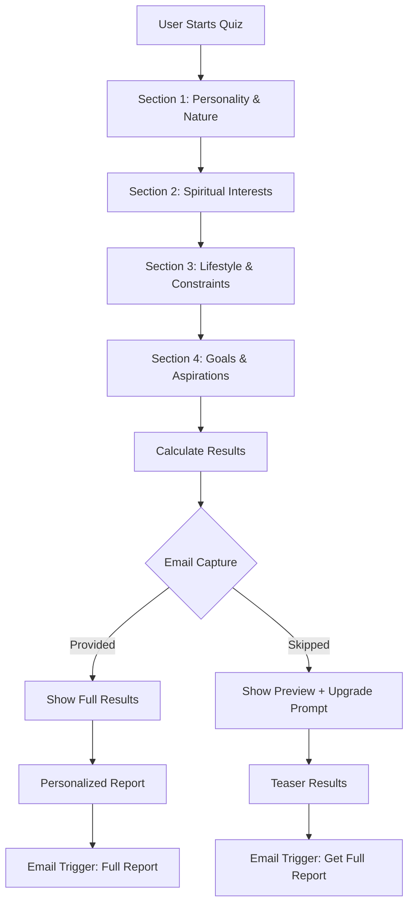

# Faith Finder Tool Strategy for Sadhaka
## Engineering-as-Marketing for Spiritual Seekers

---

## Executive Summary

**Platform:** Sadhaka - A spiritual/philosophy platform focused on Sanatan Dharma wisdom

**Tool Concept:** Interactive Faith Finder Assessment that helps spiritual seekers discover their ideal spiritual path based on their personality, interests, and life situation.

**Primary Goals:**
1. Lead generation through email capture
2. SEO traffic from "which spiritual path is right for me" type queries
3. Brand awareness and authority building
4. User education on Sadhaka's content offerings

**Target Audience:** General spiritual seekers (especially overseas) curious about Eastern wisdom, mindfulness, and finding a spiritual path that resonates with them.

---

## 1. Market Research & Opportunity Analysis

### 1.1 Search Demand Analysis

Based on the existing SEO strategy, high-intent keywords include:

| Keyword | Intent | Competition | Opportunity |
|---------|--------|-------------|-------------|
| "which spiritual path is right for me" | High | Medium | High |
| "what is my spiritual path" | High | Medium | High |
| "find my spiritual path quiz" | Very High | Low | Very High |
| "spiritual path finder" | High | Low | Very High |
| "vedanta vs buddhism" | Medium | Medium | Medium |
| "how to choose a spiritual tradition" | High | Medium | High |
| "bhakti vs jnana yoga" | Medium | Low | High |
| "which meditation is right for me" | High | Medium | High |
| "spiritual personality test" | High | Low | Very High |
| "what type of spiritual seeker am i" | High | Low | Very High |

**Key Insight:** Quiz/assessment-based keywords ("quiz", "test", "finder") have lower competition and very high intent, making them ideal for a free tool.

### 1.2 Competitive Landscape

**Existing Tools:**
- Most are generic spirituality quizzes without depth
- Few connect results to specific Eastern traditions
- Limited follow-up or nurturing
- Poor integration with educational content

**Sadhaka's Advantage:**
- Rich data on 8 traditions, 8 practices, 8 philosophies, and 5 greats
- Authentic, well-researched content
- Clear path from assessment to learning
- Existing Pathfinder foundation to build upon

### 1.3 User Pain Points

1. **Overwhelm:** Too many spiritual paths, don't know where to start
2. **Confusion:** Can't distinguish between traditions (e.g., Shaivism vs Vaishnavism)
3. **Lack of Guidance:** No personalized recommendations
4. **Entry Barrier:** Don't know which practice to begin with
5. **Information Gap:** Want to understand "what's right for me"

---

## 2. Tool Opportunity Matrix

### 2.1 Potential Tool Types

| Tool Type | Description | Lead Value | SEO Potential | Build Effort | Priority |
|-----------|-------------|------------|---------------|--------------|----------|
| **Faith Finder Quiz** | Multi-question assessment with personalized path recommendations | High | Very High | Medium | P0 |
| **Practice Matcher** | Tool to find practices based on time, goals, lifestyle | Medium | High | Low | P1 |
| **Mantra Recommender** | Suggest mantras based on intention/deity preference | Medium | Medium | Low | P2 |
| **Daily Routine Builder** | Generate personalized spiritual routines | High | Medium | High | P1 |
| **Philosophy Explorer** | Interactive guide to understanding different philosophies | Low | High | Medium | P2 |
| **Text Study Planner** | Create personalized reading/study plans | Medium | Medium | Medium | P2 |
| **Guna Assessment** | Analyze personality based on three gunas | Medium | High | Medium | P1 |

### 2.2 Tool Evaluation Scorecard (Faith Finder Quiz)

| Factor | Score (1-5) | Notes |
|--------|-------------|-------|
| Search demand exists | 5 | High volume for "quiz", "finder", "which path" |
| Audience match to buyers | 5 | Perfect alignment with spiritual seekers |
| Uniqueness vs. existing | 4 | Few quality tools in Eastern spirituality space |
| Natural path to product | 5 | Direct connection to traditions/practices content |
| Build feasibility | 4 | Quiz logic is straightforward, existing data available |
| Maintenance burden | 4 | Low - content is evergreen |
| Link-building potential | 4 | Quizzes get shared and referenced |
| Share-worthiness | 5 | High shareability on social media |
| **Total Score** | **36/40** | **Strong candidate** |

---

## 3. Faith Finder Quiz Design

### 3.1 Quiz Architecture



### 3.2 Question Structure

#### Section 1: Personality & Nature (5 questions)
- What draws you most to spirituality?
- How do you prefer to learn?
- What's your relationship with emotion?
- How do you approach problems?
- What feels most sacred to you?

#### Section 2: Spiritual Interests (4 questions)
- Which concepts intrigue you most?
- What practices have you tried or are curious about?
- How do you feel about ritual?
- What's your view of the Divine?

#### Section 3: Lifestyle & Constraints (3 questions)
- How much time can you dedicate daily?
- Do you prefer solitary or community practice?
- What's your living situation?

#### Section 4: Goals & Aspirations (3 questions)
- What's your primary spiritual goal?
- What would you like to experience?
- What challenges do you face?

**Total:** 15 questions (5-7 minutes to complete)

### 3.3 Scoring Logic

The quiz will map responses to:
1. **Primary Path Type** (from existing Pathfinder): Inquiry-led, Devotion-led, Ritual-led, Discipline-led
2. **Top 3 Traditions** that match: Shaivism, Shaktism, Vaishnavism, Smartism, Tantra, Bhakti Lineages, Kashmir Shaivism
3. **Top 3 Practices** to start with: Japa, Dhyana, Kirtan, Puja, Seva, Svadhyaya, Yoga Sadhana, Vrat
4. **Top 2 Philosophies** to explore: Vedanta, Advaita, Vishishtadvaita, Dvaita, Samkhya, Yoga Darshana, Mimamsa, Nyaya-Vaisheshika
5. **Recommended Greats** to study: Based on path and philosophy alignment

### 3.4 Result Types

| Result Type | Description | Content |
|-------------|-------------|---------|
| **Primary Path** | Main orientation (e.g., Devotion-led) | Path description, why it fits, traditions that align |
| **Tradition Match** | Top 3 traditions | Each with match score, description, how to start |
| **Practice Starter Kit** | 3 recommended practices | Each with beginner guide, time commitment, benefits |
| **Philosophy Deep Dive** | 2 philosophies to explore | Key ideas, why relevant, how to study |
| **Personalized Reading List** | Texts and greats | Curated based on results |
| **Next Steps** | Actionable plan | 7-day, 30-day, 90-day recommendations |

---

## 4. Lead Capture Strategy

### 4.1 Gating Approach

**Partially Gated (Recommended):**

| Stage | What's Visible | What's Gated | Call to Action |
|-------|---------------|--------------|----------------|
| Quiz | All questions | None | Start Quiz |
| Results Preview | Primary path type, top tradition | Full report, practices, philosophies, reading list | "Get Your Full Spiritual Path Report" |
| Full Report | Everything | None | (Already captured) |

**Rationale:** This balances user experience (they get immediate value) with lead capture (they need to provide email for the complete, actionable report).

### 4.2 Email Capture Form

**Minimal Friction:**
- Email address (required)
- First name (optional, for personalization)
- One qualifying question: "What's your biggest spiritual challenge?" (optional)

**Value Exchange:** 
"Get your complete Spiritual Path Report with personalized practice recommendations, reading lists, and a 90-day action plan delivered to your inbox."

### 4.3 Data Points Collected

| Data Point | Purpose | Usage |
|------------|---------|-------|
| Email | Lead capture | Nurture sequences, reporting |
| Name | Personalization | Email personalization |
| Quiz responses | Segmentation | Tailored content recommendations |
| Spiritual challenge | Pain point identification | Targeted follow-up |
| Path type | Primary segment | Content routing |

---

## 5. Email Nurture Sequences

### 5.1 Immediate Email (Triggered on signup)

**Subject:** Your Spiritual Path Report is Ready 🙏

**Content:**
- Thank you for taking the quiz
- Link to full report (web version)
- PDF attachment option
- Quick win: One practice to try today
- Preview of what's coming next

### 5.2 Day 1: Welcome & Orientation

**Subject:** Welcome to your spiritual journey

**Content:**
- Welcome to Sadhaka
- Reiterate their path type and top tradition
- Why this path resonates with them
- Link to tradition detail page
- One simple practice to start (5 min)

### 5.3 Day 3: Deep Dive on Primary Practice

**Subject:** Your #1 practice: [Practice Name]

**Content:**
- Detailed guide on their top recommended practice
- How to get started today
- Common mistakes to avoid
- Success stories or quotes from tradition
- Link to practice detail page

### 5.4 Day 7: Philosophy Foundation

**Subject:** The philosophy behind your path

**Content:**
- Introduction to their recommended philosophy
- Key concepts explained simply
- Why this matters for their practice
- Link to philosophy detail page
- Recommended text to start with

### 5.5 Day 14: Great Teachers to Study

**Subject:** Learn from the masters

**Content:**
- 2-3 greats aligned with their path
- Brief biography and key teachings
- Why they're relevant today
- Recommended works
- Link to greats detail pages

### 5.6 Day 30: Progress Check & Next Steps

**Subject:** How is your practice going?

**Content:**
- Check-in on their journey
- Common challenges at this stage
- How to deepen their practice
- Next tradition or philosophy to explore
- Invitation to community (if exists)

### 5.7 Ongoing: Weekly/Bi-weekly Content

**Segmented by path type:**
- Inquiry-led: Philosophy deep dives, self-inquiry practices
- Devotion-led: Bhakti stories, kirtan playlists, deity information
- Ritual-led: Puja guides, festival information, ritual meanings
- Discipline-led: Practice routines, yoga sequences, discipline tips

---

## 6. SEO Strategy

### 6.1 Landing Page Optimization

**Primary Page:** `/faith-finder` or `/spiritual-path-quiz`

**Title Tag:** Spiritual Path Finder Quiz | Discover Your Ideal Spiritual Tradition

**Meta Description:** Take our free spiritual path quiz to discover which Eastern tradition, practices, and philosophies align with your personality and goals. Get your personalized report.

**H1:** Find Your Spiritual Path in 5 Minutes

**Key Content Sections:**
1. Quiz introduction and value proposition
2. What you'll discover (traditions, practices, philosophies)
3. How it works (simple 3-step process)
4. Social proof (testimonials, number of people who took quiz)
5. FAQ about the quiz
6. CTA to start quiz

### 6.2 Supporting Content Pages

Create pages that target specific long-tail keywords:

| Page | Target Keyword | Purpose |
|------|----------------|---------|
| `/spiritual-paths-explained` | "spiritual paths explained" | Educational content linking to quiz |
| `/inquiry-vs-devotion-path` | "inquiry vs devotion path" | Comparison content |
| `/which-meditation-for-me` | "which meditation is right for me" | Practice-specific landing |
| `/starting-spiritual-practice` | "how to start spiritual practice" | Beginner guide |

### 6.3 Schema Markup

Implement:
- Quiz schema for the tool
- Article schema for supporting pages
- FAQ schema for quiz FAQ section
- Breadcrumb schema for navigation

### 6.4 Link Building Strategy

1. **Resource Pages:** Reach out to spirituality blogs, yoga studios, meditation centers
2. **Guest Posts:** Write articles about finding one's spiritual path
3. **Social Sharing:** Shareable results with "I'm a Devotion-led seeker, what are you?"
4. **Embeddable Widget:** Allow other sites to embed the quiz
5. **Influencer Outreach:** Partner with spiritual teachers/influencers

---

## 7. Technical Implementation Plan

### 7.1 Frontend Components

| Component | Description | Priority |
|-----------|-------------|----------|
| Quiz Container | Main quiz wrapper with progress bar | P0 |
| Question Component | Individual question rendering | P0 |
| Results Preview | Gated results view | P0 |
| Full Results | Complete report with all sections | P0 |
| Email Capture Form | Minimal email collection | P0 |
| Share Results | Social sharing of quiz results | P1 |
| Retake Quiz | Option to take quiz again | P2 |

### 7.2 Backend Requirements

| Feature | Description | Priority |
|---------|-------------|----------|
| Quiz API | Submit answers, get results | P0 |
| Email Service | Trigger nurture sequences | P0 |
| Lead Storage | Store quiz responses and emails | P0 |
| Results Generator | Generate personalized reports | P0 |
| Analytics | Track quiz completion, drop-off | P1 |
| A/B Testing | Test different question flows | P2 |

### 7.3 Data Structure

```typescript
// Quiz Response
interface QuizResponse {
  id: string;
  email: string;
  name?: string;
  spiritualChallenge?: string;
  responses: {
    [questionId: string]: string | string[];
  };
  calculatedResults: {
    primaryPath: PathType;
    traditions: Tradition[];
    practices: Practice[];
    philosophies: Philosophy[];
    greats: Great[];
  };
  completedAt: Date;
}

// Quiz Question
interface QuizQuestion {
  id: string;
  section: string;
  question: string;
  type: 'single' | 'multiple' | 'scale';
  options: QuizOption[];
  weights: {
    [pathType: string]: number;
  };
}
```

### 7.4 Scoring Algorithm

1. **Weighted Scoring:** Each answer contributes points to different path types
2. **Multi-dimensional:** Score across path types, traditions, practices, philosophies
3. **Thresholds:** Minimum scores for recommendations
4. **Fallbacks:** If scores are tied, use secondary criteria

### 7.5 Integration Points

- **Existing Data:** Use `traditions.ts`, `practices.ts`, `philosophies.ts`, `greats.ts`
- **Email Service:** Integrate with existing email provider
- **Analytics:** Track events for quiz start, completion, email capture
- **Routing:** Link results to existing detail pages

---

## 8. Success Metrics & KPIs

### 8.1 Acquisition Metrics

| Metric | Target | Measurement |
|--------|--------|-------------|
| Quiz Starts | 1,000/month | Page views of quiz page |
| Quiz Completions | 40% completion rate | Completed / Started |
| Email Capture Rate | 60% of completions | Emails / Completions |
| Organic Traffic | 500/month to quiz page | Google Analytics |

### 8.2 Engagement Metrics

| Metric | Target | Measurement |
|--------|--------|-------------|
| Email Open Rate | 45% | Email platform analytics |
| Email Click Rate | 15% | Link clicks / Opens |
| Report Views | 80% of captures | Page views of results |
| Time on Results Page | 3+ minutes | Average session duration |

### 8.3 Conversion Metrics

| Metric | Target | Measurement |
|--------|--------|-------------|
| Sign-up Rate | 10% of email leads | Account creation |
| Content Engagement | 50% visit tradition pages | Page views from email |
| Retention | 30% open rate after 30 days | Long-term email engagement |

### 8.4 SEO Metrics

| Metric | Target | Measurement |
|--------|--------|-------------|
| Keyword Rankings | Top 10 for 5+ keywords | Search Console |
| Organic Traffic Growth | 20% month-over-month | Google Analytics |
| Backlinks | 10+ quality links | Ahrefs/Moz |
| Featured Snippets | 1+ snippet capture | Search Console |

---

## 9. Implementation Tasks

### Task 1: Quiz Content & Scoring Logic
- Write all 15 quiz questions with options
- Define scoring weights for each answer
- Create mapping algorithm for results
- Test scoring logic with sample responses

### Task 2: Frontend Quiz UI
- Create quiz container component
- Build question renderer
- Implement progress bar
- Create results preview page
- Build full results page
- Add email capture form
- Implement share results feature

### Task 3: Backend API
- Create quiz submission endpoint
- Implement scoring algorithm
- Build results generation
- Set up email triggers
- Store quiz responses

### Task 4: Email Integration
- Set up email service integration
- Create email templates (immediate, Day 1, Day 3, Day 7, Day 14, Day 30)
- Implement nurture sequence logic
- Add PDF report generation
- Set up email tracking

### Task 5: Landing Page
- Create quiz landing page at `/faith-finder`
- Write compelling copy
- Add FAQ section
- Implement schema markup
- Optimize for SEO

### Task 6: Analytics & Tracking
- Set up quiz event tracking
- Track completion rates
- Monitor email open/click rates
- Create dashboard for metrics

### Task 7: Additional Features
- Retake quiz functionality
- Save results to account
- A/B testing framework
- Embeddable widget
- Mobile optimization

---

## 10. Risk Mitigation

### 10.1 Potential Risks

| Risk | Likelihood | Impact | Mitigation |
|------|------------|--------|------------|
| Low quiz completion rate | Medium | High | Keep quiz short, show progress, save and resume |
| Poor email deliverability | Low | High | Use reputable ESP, warm up IPs, monitor sender reputation |
| Results don't resonate | Medium | Medium | Test with users before launch, iterate on scoring |
| SEO competition increases | High | Medium | Focus on long-tail, build quality backlinks, create supporting content |
| Technical issues with scoring | Low | Medium | Thorough testing, edge case handling, fallback logic |

### 10.2 Testing Plan

1. **Alpha Test:** Internal team (10 people)
2. **Beta Test:** Friendly users (50 people)
3. **Soft Launch:** Limited traffic, monitor closely
4. **Full Launch:** Promote across channels

---

## 11. Launch Strategy

### Pre-Launch Checklist
- Finalize quiz content and scoring
- Build all core features
- Set up email sequences
- Create landing page
- Test end-to-end flow

### Launch Activities
- Announce to existing email list
- Share on social media
- Post in relevant communities
- Reach out to partners/influencers

### Post-Launch Optimization
- Monitor metrics daily
- Iterate based on feedback
- Optimize drop-off points
- Create supporting content

### Ongoing Activities
- A/B test questions and flows
- Expand nurture sequences
- Build additional tools (Practice Matcher, etc.)
- Create content around quiz results

---

## 12. Additional Tool Opportunities

### 12.1 Practice Matcher Tool

**Concept:** Quick tool to find practices based on time availability and goals

**Inputs:**
- Time available (5 min, 15 min, 30 min, 1 hour)
- Goal (calm mind, devotion, discipline, knowledge)
- Experience level (beginner, intermediate)

**Outputs:**
- 3 recommended practices
- How to start each
- Links to detail pages

**Lead Capture:** Optional email for "Practice Guide PDF"

### 12.2 Mantra Recommender

**Concept:** Suggest mantras based on intention or deity preference

**Inputs:**
- Intention (peace, protection, abundance, wisdom)
- Deity preference (optional)
- Sanskrit comfort level

**Outputs:**
- 3 recommended mantras
- Meaning and significance
- How to chant
- Audio samples (if available)

**Lead Capture:** Optional email for "Mantra Chanting Guide"

### 12.3 Daily Routine Builder

**Concept:** Generate personalized spiritual routines

**Inputs:**
- Wake time
- Available time in morning
- Path type
- Experience level

**Outputs:**
- Complete morning routine
- Step-by-step instructions
- Time allocations
- Links to practice guides

**Lead Capture:** Email required for "Custom Routine PDF"

---

## 13. Content Integration Strategy

### 13.1 Quiz → Content Mapping

| Quiz Result | Content to Promote | Call to Action |
|-------------|-------------------|----------------|
| Devotion-led Path | Vaishnavism, Shaktism, Bhakti Lineages pages | "Learn more about devotional traditions" |
| Japa Practice | Japa practice detail page | "Start your japa practice today" |
| Advaita Philosophy | Advaita Vedanta page | "Deepen your understanding" |
| Adi Shankaracharya | Greats detail page | "Study the master of Advaita" |

### 13.2 Email → Content Flow

```
Quiz Result → Email Sequence → Content Pages → Deeper Engagement
     ↓              ↓                ↓                  ↓
  Path Type    Daily Tips      Tradition Pages      Sign Up
     ↓              ↓                ↓                  ↓
  Practices    Weekly Reads    Practice Pages      Account
     ↓              ↓                ↓                  ↓
  Philosophies   Monthly       Philosophy Pages      Premium
```

---

## 14. Summary & Next Steps

### 14.1 Key Takeaways

1. **High Opportunity:** Quiz/assessment keywords have high intent and low competition
2. **Strong Foundation:** Existing content data makes implementation feasible
3. **Clear Value Proposition:** Addresses real user pain points
4. **Scalable:** Can expand to multiple related tools
5. **Measurable:** Clear metrics for success

### 14.2 Immediate Actions

1. **Approve Strategy:** Review and finalize this plan
2. **Design Quiz Content:** Write all 15 questions and options
3. **Define Scoring Logic:** Map answers to path types, traditions, practices
4. **Set Up Tech Stack:** Choose email provider, analytics, storage
5. **Create Landing Page Copy:** Write compelling copy for quiz page
6. **Build Email Sequences:** Write all nurture emails
7. **Begin Development:** Start with MVP features

---

## Appendix A: Sample Quiz Questions

### Personality & Nature Section

**Q1:** What draws you most to spirituality?
- A) Understanding the nature of reality and consciousness
- B) Feeling a deep love and connection with the Divine
- C) Participating in sacred rituals and ceremonies
- D) Cultivating discipline and self-mastery

**Q2:** How do you prefer to learn?
- A) Through study, contemplation, and intellectual inquiry
- B) Through devotion, song, and emotional experience
- C) Through practice, ritual, and sensory engagement
- D) Through systematic training and structured practice

**Q3:** What feels most sacred to you?
- A) The silence and stillness of meditation
- B) The presence of the Divine in all things
- C) The precise performance of sacred rites
- D) The transformation through disciplined practice

### Spiritual Interests Section

**Q4:** Which concepts intrigue you most?
- A) Non-duality, consciousness, the nature of self
- B) Divine love, devotion, surrender to God
- C) Sacred rituals, mantras, yantras
- D) Yoga, energy work, systematic transformation

**Q5:** How do you feel about ritual?
- A) Interesting but not essential
- B) Beautiful and meaningful
- C) Essential and powerful
- D) Useful as a framework for practice

### Lifestyle & Constraints Section

**Q6:** How much time can you dedicate daily?
- A) 5-10 minutes
- B) 15-30 minutes
- C) 30-60 minutes
- D) 1+ hours

**Q7:** Do you prefer solitary or community practice?
- A) Solitary
- B) Mostly solitary, occasional community
- C) Balanced mix
- D) Community-focused

### Goals & Aspirations Section

**Q8:** What's your primary spiritual goal?
- A) Self-realization and understanding
- B) Divine love and devotion
- C) Sacred living and dharmic action
- D) Self-mastery and transformation

**Q9:** What would you like to experience?
- A) Deep peace and clarity
- B) Divine love and bliss
- C) Sacred connection through ritual
- D) Personal growth and transformation

---

## Appendix B: Email Sequence Templates

### Immediate Email Template

**Subject:** Your Spiritual Path Report is Ready 🙏

**Body:**
```
Namaste [Name],

Thank you for taking the Spiritual Path Quiz!

Your personalized report is ready and reveals:

✨ Your Primary Path: [Path Type]
🕉️ Top Traditions for You: [Tradition 1], [Tradition 2]
🧘 Best Practices to Start: [Practice 1], [Practice 2]
📚 Recommended Reading: [Text 1], [Great 1]

[Link: View Your Full Report]

Quick Win for Today:
Start with [Practice Name] - just 5 minutes to begin your journey.

[Link: Learn How to Do [Practice Name]]

Over the next few weeks, I'll send you personalized guidance based on your unique spiritual path.

With gratitude,
The Sadhaka Team
```

---

## Appendix C: Scoring Algorithm Example

```typescript
// Example scoring logic
function calculateResults(responses: QuizResponse): QuizResults {
  const scores = {
    inquiry: 0,
    devotion: 0,
    ritual: 0,
    discipline: 0
  };

  // Weight each question's answer
  responses.answers.forEach((answer, questionId) => {
    const question = questions[questionId];
    const option = question.options.find(o => o.id === answer);
    
    if (option) {
      scores.inquiry += option.weights.inquiry || 0;
      scores.devotion += option.weights.devotion || 0;
      scores.ritual += option.weights.ritual || 0;
      scores.discipline += option.weights.discipline || 0;
    }
  });

  // Find highest scoring path
  const primaryPath = Object.entries(scores)
    .sort((a, b) => b[1] - a[1])[0][0] as PathType;

  // Map to traditions, practices, philosophies
  const traditions = getTraditionsForPath(primaryPath);
  const practices = getPracticesForPath(primaryPath, responses);
  const philosophies = getPhilosophiesForPath(primaryPath);
  const greats = getGreatsForPath(primaryPath, philosophies);

  return {
    primaryPath,
    traditions,
    practices,
    philosophies,
    greats
  };
}
```

---

*Document Version: 1.0*
*Last Updated: 2025-02-09*
