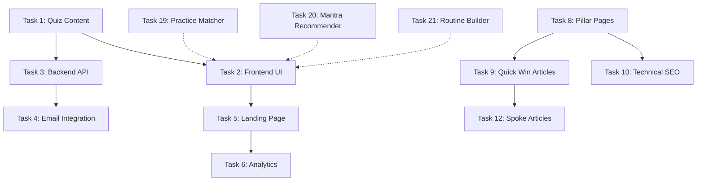

# Pending Tasks Consolidated
## All Executable Tasks from SEO Strategy & Faith Finder Tool Strategy

---

## Faith Finder Tool Tasks

### Task 1: Quiz Content & Scoring Logic
- Write all 15 quiz questions with options
- Define scoring weights for each answer
- Create mapping algorithm for results
- Test scoring logic with sample responses

### Task 2: Frontend Quiz UI
- Create quiz container component
- Build question renderer
- Implement progress bar
- Create results preview page
- Build full results page
- Add email capture form
- Implement share results feature

### Task 3: Backend API
- Create quiz submission endpoint
- Implement scoring algorithm
- Build results generation
- Set up email triggers
- Store quiz responses

### Task 4: Email Integration
- Set up email service integration
- Create email templates (immediate, Day 1, Day 3, Day 7, Day 14, Day 30)
- Implement nurture sequence logic
- Add PDF report generation
- Set up email tracking

### Task 5: Landing Page
- Create quiz landing page at `/faith-finder`
- Write compelling copy
- Add FAQ section
- Implement schema markup
- Optimize for SEO

### Task 6: Analytics & Tracking
- Set up quiz event tracking
- Track completion rates
- Monitor email open/click rates
- Create dashboard for metrics

### Task 7: Additional Features
- Retake quiz functionality
- Save results to account
- A/B testing framework
- Embeddable widget
- Mobile optimization

---

## SEO Content Strategy Tasks

### Task 8: Create 4 Pillar Hub Pages
- Create `/ancient-wisdom-philosophies` hub page (2000+ words)
- Create `/practical-spiritual-practices` hub page (2000+ words)
- Create `/sacred-texts-teachings` hub page (2000+ words)
- Create `/spiritual-traditions-paths` hub page (2000+ words)

### Task 9: Publish 10 High-Priority Quick-Win Articles
1. "What is Vedanta? A Complete Beginner's Guide"
2. "How to Start Japa Meditation: Step-by-Step Guide"
3. "Bhagavad Gita Chapter 1: Arjuna's Dilemma Explained"
4. "Advaita Vedanta Explained Simply for Western Minds"
5. "10 Powerful Sanskrit Mantras and Their Meanings"
6. "Shaivism vs Vaishnavism: Understanding the Differences"
7. "Daily Spiritual Routine for Beginners: A Practical Guide"
8. "Who is Adi Shankaracharya? Life and Teachings"
9. "How to Choose a Mantra: Complete Guide"
10. "Non-Duality vs Dualism: Understanding Philosophical Difference"

### Task 10: Set Up Technical SEO Foundation
- Set up Google Search Console
- Implement basic schema markup
- Create XML sitemap
- Set up Google Analytics
- Configure page speed optimization

### Task 11: Create Content Calendar Template
- Define weekly production schedule
- Establish monthly themes
- Create content workflow process

### Task 12: Create Spoke Articles (12-16 total)
- Create 3-4 spoke articles per pillar
- Add internal linking strategy
- Link to hub pages

### Task 13: Add Video Content
- Create explainer videos for top articles
- Create practice tutorials
- Produce short clips for social media

### Task 14: Create Audio Content
- Add audio versions of popular articles
- Create guided meditations
- Record mantra chanting

### Task 15: Create Comprehensive Guides
- Create guides for major topics
- Add interactive elements (quizzes, calculators)
- Optimize underperforming content

### Task 16: Build Backlinks
- Outreach to spirituality blogs
- Guest posting on relevant sites
- Partner with yoga studios/meditation centers

### Task 17: Programmatic SEO
- Create scalable content pages
- Build comparison pages
- Generate location-based content

---

## Supporting Content Pages for Faith Finder

### Task 18: Create Supporting Landing Pages
- `/spiritual-paths-explained` - "spiritual paths explained"
- `/inquiry-vs-devotion-path` - "inquiry vs devotion path"
- `/which-meditation-for-me` - "which meditation is right for me"
- `/starting-spiritual-practice` - "how to start spiritual practice"

---

## Additional Tool Opportunities

### Task 19: Practice Matcher Tool
- Create tool to find practices by time/goals
- Build simple input form
- Generate practice recommendations
- Add optional email capture for PDF guide

### Task 20: Mantra Recommender
- Create tool to suggest mantras by intention
- Build intention/deity selection
- Generate mantra recommendations
- Add optional email capture for guide

### Task 21: Daily Routine Builder
- Create tool to generate spiritual routines
- Build time/path inputs
- Generate personalized routine
- Add email capture for PDF

---

## Task Priority Matrix

| Priority | Tasks | Rationale |
|----------|--------|-----------|
| **P0** | Task 1, Task 2, Task 3, Task 4, Task 5 | Core Faith Finder Quiz - highest impact |
| **P1** | Task 8, Task 9, Task 10 | SEO Foundation - drives organic traffic |
| **P2** | Task 6, Task 7, Task 18 | Quiz enhancements and supporting pages |
| **P3** | Task 12, Task 13, Task 14 | Content expansion - scales traffic |
| **P4** | Task 15, Task 16, Task 17 | Advanced SEO and growth |
| **P5** | Task 19, Task 20, Task 21 | Additional tools - future expansion |

---

## Task Dependencies

---

## Recommended Execution Order

### Batch 1: Faith Finder Core (Tasks 1-5)
1. Task 1: Quiz Content & Scoring Logic
2. Task 3: Backend API (can run parallel with Task 2)
3. Task 2: Frontend Quiz UI
4. Task 4: Email Integration
5. Task 5: Landing Page

### Batch 2: SEO Foundation (Tasks 8-10)
6. Task 10: Technical SEO Foundation
7. Task 8: Create 4 Pillar Hub Pages
8. Task 9: Publish 10 Quick-Win Articles

### Batch 3: Quiz Enhancements (Tasks 6-7)
9. Task 6: Analytics & Tracking
10. Task 7: Additional Features

### Batch 4: Content Expansion (Tasks 11-14)
11. Task 11: Create Content Calendar Template
12. Task 12: Create Spoke Articles
13. Task 13: Add Video Content
14. Task 14: Create Audio Content

### Batch 5: Supporting Pages (Task 18)
15. Task 18: Create Supporting Landing Pages

### Batch 6: Additional Tools (Tasks 19-21)
16. Task 19: Practice Matcher Tool
17. Task 20: Mantra Recommender
18. Task 21: Daily Routine Builder

### Batch 7: Advanced SEO (Tasks 15-17)
19. Task 15: Create Comprehensive Guides
20. Task 16: Build Backlinks
21. Task 17: Programmatic SEO

---

## Notes

- All tasks can be executed as separate, independent work sessions
- Tasks within each batch can often be done in parallel
- Some tasks have dependencies (see Task Dependencies section)
- Priority can be adjusted based on business goals and resources
- Each task should result in a completed, working feature or content piece

---

*Document Version: 1.0*
*Last Updated: 2025-02-09*
