# Sadhaka SEO Content Strategy
## Driving Overseas Traffic Through Long-Tail SEO

---

## Executive Summary

**Platform:** Sadhaka - A spiritual/philosophy platform focused on Sanatan Dharma wisdom

**Target Audience:** General spiritual seekers curious about Eastern wisdom and mindfulness

**Primary Goal:** Drive organic traffic to the platform

**Strategy Focus:** Long-tail SEO targeting overseas audiences interested in authentic Indian spiritual wisdom, practices, and philosophies

---

## 1. Content Pillars

Based on Sadhaka's existing content structure and search demand patterns, I recommend **4 core content pillars**:

### Pillar 1: Ancient Wisdom & Philosophies
**Rationale:** Western audiences are increasingly searching for deeper philosophical frameworks beyond surface-level mindfulness. This pillar addresses the "what is" and "why" questions about Eastern wisdom.

**Connection to Product:** Maps to existing [`philosophies.ts`](src/data/philosophies.ts) and [`greats.ts`](src/data/greats.ts) data structures.

**Subtopic Clusters:**
- Vedanta and non-dual philosophy
- Advaita Vedanta for beginners
- Kashmir Shaivism and consciousness
- Great sages and their teachings
- Ancient philosophical frameworks

### Pillar 2: Practical Spiritual Practices
**Rationale:** High-intent searches from people actively looking for techniques to implement. This is where people are ready to take action.

**Connection to Product:** Maps to existing [`practices.ts`](src/data/practices.ts) data structure.

**Subtopic Clusters:**
- Meditation techniques (Dhyana)
- Mantra chanting (Japa)
- Daily spiritual routines
- Yoga philosophy beyond asana
- Breathwork and pranayama

### Pillar 3: Sacred Texts & Teachings
**Rationale:** People searching for specific texts, verses, and interpretations. This establishes authority and provides deep, referenceable content.

**Connection to Product:** Maps to existing [`texts.ts`](src/data/texts.ts) data structure.

**Subtopic Clusters:**
- Bhagavad Gita explanations
- Upanishad wisdom
- Key Sanskrit verses explained
- How to approach ancient texts
- Modern applications of ancient wisdom

### Pillar 4: Spiritual Traditions & Paths
**Rationale:** Helps people understand different approaches and find what resonates with them. Addresses the "which path is right for me" question.

**Connection to Product:** Maps to existing [`traditions.ts`](src/data/traditions.ts) data structure.

**Subtopic Clusters:**
- Shaivism: Shiva worship and philosophy
- Shaktism: Divine feminine wisdom
- Vaishnavism: Devotion and bhakti
- Choosing your spiritual path
- Understanding different lineages

---

## 2. Topic Cluster Map

```mermaid
graph TD
    A[Sadhaka Content Strategy] --> B[Pillar 1: Ancient Wisdom]
    A --> C[Pillar 2: Practical Practices]
    A --> D[Pillar 3: Sacred Texts]
    A --> E[Pillar 4: Spiritual Traditions]

    B --> B1[Vedanta Explained]
    B --> B2[Advaita for Beginners]
    B --> B3[Great Sages Series]
    B --> B4[Philosophy Comparisons]

    C --> C1[Meditation Techniques]
    C --> C2[Mantra & Japa Guide]
    C --> C3[Daily Routines]
    C --> C4[Practice for Beginners]

    D --> D1[Bhagavad Gita Deep Dives]
    D --> D2[Upanishad Wisdom]
    D --> D3[Key Sanskrit Verses]
    D --> D4[Text Study Guides]

    E --> E1[Shaivism Explained]
    E --> E2[Shaktism & Divine Feminine]
    E --> E3[Vaishnavism & Bhakti]
    E --> E4[Path Selection Guide]
```

---

## 3. Priority Topics with Long-Tail Keywords

### High-Priority Topics (Quick Wins)

#### Pillar 1: Ancient Wisdom & Philosophies

| Topic | Target Keyword | Buyer Stage | Content Type | Why This Topic |
|-------|---------------|-------------|-------------|----------------|
| What is Vedanta? A Complete Beginner's Guide | "what is vedanta" | Awareness | Hub/Spoke | Foundational concept with growing search interest |
| Advaita Vedanta Explained Simply | "advaita vedanta explained" | Awareness | Use-Case | Addresses complexity barrier; high curiosity |
| Who is Adi Shankaracharya? His Life and Teachings | "adi shankaracharya biography" | Awareness | Use-Case | Connects to existing greats data; authoritative |
| Non-duality vs Dualism: Understanding the Difference | "non dual vs dual philosophy" | Consideration | Comparison | Comparative content ranks well; clarifies confusion |
| Kashmir Shaivism: The Philosophy of Recognition | "kashmir shaivism explained" | Awareness | Use-Case | Niche but growing interest; unique differentiation |

#### Pillar 2: Practical Spiritual Practices

| Topic | Target Keyword | Buyer Stage | Content Type | Why This Topic |
|-------|---------------|-------------|-------------|----------------|
| How to Start Japa Meditation: Complete Guide | "how to start japa meditation" | Implementation | Tutorial | High-intent; actionable; maps to practices data |
| Mantra Chanting for Beginners: Step-by-Step | "mantra chanting for beginners" | Implementation | Tutorial | Practical guidance; high search volume |
| Daily Spiritual Routine for Beginners | "daily spiritual routine" | Implementation | Template | Solves "how do I start" problem; shareable |
| Dhyana Meditation: Ancient Practice for Modern Minds | "dhyana meditation technique" | Awareness | Use-Case | Bridges ancient wisdom with modern application |
| 10 Powerful Sanskrit Mantras and Their Meanings | "sanskrit mantras with meaning" | Awareness | Listicle | Highly shareable; evergreen content |

#### Pillar 3: Sacred Texts & Teachings

| Topic | Target Keyword | Buyer Stage | Content Type | Why This Topic |
|-------|---------------|-------------|-------------|----------------|
| Bhagavad Gita Chapter 1 Summary: Arjuna's Dilemma | "bhagavad gita chapter 1 summary" | Awareness | Hub/Spoke | Series potential; each chapter is a topic |
| Key Teachings from the Upanishads Explained | "upanishad teachings explained" | Awareness | Hub/Spoke | Educational; establishes authority |
| "Tat Tvam Asi": Meaning and Significance | "tat tvam asi meaning" | Awareness | Deep Dive | Specific verse searches; high intent |
| How to Read the Bhagavad Gita for Beginners | "how to read bhagavad gita" | Implementation | Tutorial | Addresses entry barrier; practical guidance |
| 10 Most Important Sanskrit Verses for Spiritual Growth | "important sanskrit verses" | Awareness | Listicle | Shareable; referenceable |

#### Pillar 4: Spiritual Traditions & Paths

| Topic | Target Keyword | Buyer Stage | Content Type | Why This Topic |
|-------|---------------|-------------|-------------|----------------|
| Shaivism vs Vaishnavism: Understanding the Differences | "shaivism vs vaishnavism" | Consideration | Comparison | Comparative content performs well; clarifies confusion |
| Shaktism: Understanding the Divine Feminine in Hinduism | "shaktism divine feminine" | Awareness | Use-Case | Growing interest in feminine spirituality |
| Which Spiritual Path is Right for Me? | "which spiritual path for me" | Consideration | Interactive | High-intent; personalized content opportunity |
| The 5 Acts of Shiva in Kashmir Shaivism | "5 acts of shiva" | Awareness | Deep Dive | Niche but authoritative; unique content |
| Panchakshari Mantra: Meaning and Practice | "panchakshari mantra meaning" | Implementation | Tutorial | Specific practice with search demand |

---

## 4. Content by Buyer Stage

### Awareness Stage (Educational Content)
**Keywords:** "what is", "guide to", "introduction to", "explained"

**Topics:**
- What is Vedanta? Complete Guide
- Advaita Vedanta Explained Simply
- Kashmir Shaivism Introduction
- Bhagavad Gita Overview
- Understanding Non-Duality

**Content Format:** Long-form blog posts (2000+ words), explainer videos, infographics

### Consideration Stage (Comparative Content)
**Keywords:** "vs", "comparison", "best", "which", "differences"

**Topics:**
- Shaivism vs Vaishnavism Comparison
- Non-dual vs Dual Philosophy
- Japa vs Silent Meditation
- Different Paths of Yoga Explained
- Which Spiritual Tradition Suits You?

**Content Format:** Comparison articles, interactive quizzes, decision trees

### Implementation Stage (Practical Content)
**Keywords:** "how to", "tutorial", "step by step", "guide", "practice"

**Topics:**
- How to Start Japa Meditation
- Daily Spiritual Routine Template
- Mantra Chanting Step-by-Step
- How to Practice Self-Inquiry
- Setting Up Your Meditation Space

**Content Format:** Tutorials, video guides, downloadable templates, checklists

---

## 5. Content Format Recommendations

Given you have a full content suite (blog, video, audio) with a dedicated team, here's the optimal format mix:

### Blog Posts (Primary - 60%)
- **Long-form guides** (2000-3000 words) for hub content
- **Medium articles** (1000-1500 words) for spoke content
- **Listicles** (800-1200 words) for shareable content
- **Quick tips** (500-800 words) for easy wins

### Video Content (Secondary - 25%)
- **Explainer videos** (5-10 min) for complex concepts
- **Practice tutorials** (10-15 min) for techniques
- **Short clips** (60-90 sec) for social media and teasers
- **Interview series** with scholars/practitioners

### Audio Content (Tertiary - 15%)
- **Podcast episodes** expanding on blog topics
- **Guided meditations** and mantra recordings
- **Audio versions** of popular articles

### Format Integration Strategy:
1. **Primary content** on blog (SEO-optimized)
2. **Video embeds** within blog posts (engagement + dwell time)
3. **Audio versions** for accessibility (expand reach)
4. **Social snippets** from all formats (distribution)

---

## 6. Long-Tail Keyword Strategy

### Why Long-Tail Keywords for Overseas Traffic?

1. **Lower Competition:** Less crowded than broad terms like "meditation" or "yoga"
2. **Higher Intent:** More specific searches indicate deeper interest
3. **Better Conversion:** Targeted queries align better with Sadhaka's offerings
4. **Voice Search Ready:** Natural language matches how people ask questions

### Long-Tail Keyword Categories

#### Category 1: "For Beginners" Keywords
- "vedanta for beginners"
- "japa meditation for beginners"
- "how to start spiritual practice"
- "sanskrit for beginners"
- "eastern philosophy for westerners"

#### Category 2: "How To" Keywords
- "how to chant om namah shivaya"
- "how to practice self inquiry"
- "how to read upanishads"
- "how to choose a mantra"
- "how to meditate on breath"

#### Category 3: "Meaning Of" Keywords
- "meaning of tat tvam asi"
- "meaning of om namah shivaya"
- "meaning of brahman"
- "meaning of atman"
- "meaning of maya in vedanta"

#### Category 4: "Best For" Keywords
- "best meditation for anxiety vedanta"
- "best mantra for beginners"
- "best book on advaita vedanta"
- "best practice for self realization"
- "best upanishad to start with"

#### Category 5: "Vs" Comparison Keywords
- "advaita vs dvaita"
- "japa vs silent meditation"
- "shaivism vs vaishnavism"
- "vedanta vs buddhism"
- "karma yoga vs bhakti yoga"

#### Category 6: Question-Based Keywords
- "what is the difference between atman and brahman"
- "why chant mantras 108 times"
- "what are the four paths of yoga"
- "who founded advaita vedanta"
- "what is the goal of vedanta"

---

### Pillar-Specific Long-Tail Keywords

#### Pillar 1: Ancient Wisdom & Philosophies

**Vedanta Keywords**
- "what is vedanta philosophy"
- "vedanta for beginners pdf"
- "advaita vedanta introduction"
- "dvaita vedanta explained"
- "vishishtadvaita philosophy"
- "three schools of vedanta"
- "vedanta and consciousness"
- "vedanta and modern science"
- "vedanta for anxiety"
- "vedanta for depression"
- "vedanta non dualism"
- "brahman in vedanta"
- "atman in vedanta"
- "maya illusion vedanta"
- "moksha liberation vedanta"
- "vedanta self inquiry"
- "vedanta meditation techniques"
- "vedanta daily practice"
- "vedanta books for beginners"
- "best vedanta teacher"
- "vedanta online course"
- "vedanta retreat"
- "vedanta ashram"
- "vedanta philosophy summary"
- "vedanta core teachings"

**Advaita Keywords**
- "advaita vedanta for beginners"
- "what is advaita vedanta"
- "advaita non dual philosophy"
- "tat tvam asi meaning"
- "aham brahmasmi meaning"
- "ayam atma brahma meaning"
- "prajnanam brahma meaning"
- "advaita self realization"
- "advaita and buddhism difference"
- "advaita and taoism"
- "advaita and quantum physics"
- "ramana maharshi advaita"
- "nisargadatta maharaj advaita"
- "adi shankaracharya advaita"
- "vivekachudamani explained"
- "atma bodha explained"
- "advaita meditation"
- "advaita practice daily"
- "advaita teacher near me"
- "advaita books english"
- "advaita vedanta course online"

**Kashmir Shaivism Keywords**
- "kashmir shaivism explained"
- "what is kashmir shaivism"
- "pratyabhijna philosophy"
- "shiva sutras of vasugupta"
- "spanda karikas explained"
- "abhinavagupta philosophy"
- "kashmir shaivism vs advaita"
- "kashmir shaivism tantra"
- "shakti in kashmir shaivism"
- "recognition philosophy kashmir shaivism"
- "kashmir shaivism meditation"
- "kashmir shaivism practices"
- "kashmir shaivism books"
- "kashmir shaivism teacher"
- "kashmir shaivism online course"
- "trika philosophy"
- "kaula tantra kashmir shaivism"
- "krama philosophy kashmir shaivism"
- "spanda school kashmir shaivism"

**Great Sages Keywords**
- "adi shankaracharya life story"
- "adi shankaracharya teachings"
- "adi shankaracharya four mathas"
- "adi shankaracharya books"
- "abhinavagupta biography"
- "abhinavagupta aesthetics"
- "abhinavagupta tantra"
- "ramana maharshi biography"
- "ramana maharshi self inquiry"
- "ramana maharshi who am i"
- "nisargadatta maharaj i am that"
- "nisargadatta maharaj teachings"
- "swami vivekananda philosophy"
- "swami vivekananda vedanta"
- "swami vivekananda books"
- "sri aurobindo integral yoga"
- "sri aurobindo philosophy"
- "sri aurobindo life divine"
- "paramahansa yogananda autobiography"
- "paramahansa yogananda kriya yoga"
- "ramakrishna teachings"
- "ramakrishna vedanta"
- "great hindu philosophers"
- "indian spiritual masters"
- "hindu saints and sages"

---

#### Pillar 2: Practical Spiritual Practices

**Meditation (Dhyana) Keywords**
- "dhyana meditation technique"
- "how to practice dhyana"
- "dhyana vs meditation"
- "dhyana in patanjali yoga"
- "dhyana meditation benefits"
- "dhyana for beginners"
- "dhyana meditation steps"
- "dhyana concentration practice"
- "dhyana samadhi"
- "dhyana meditation time"
- "dhyana posture"
- "dhyana breathing"
- "dhyana mindfulness"
- "dhyana vedanta"
- "dhyana buddhism"
- "dhyana hinduism"
- "dhyana meditation guide"
- "dhyana meditation tips"
- "dhyana meditation problems"
- "dhyana meditation results"
- "dhyana meditation experiences"

**Japa Keywords**
- "japa meditation for beginners"
- "how to do japa meditation"
- "japa with mala beads"
- "japa meditation benefits"
- "japa mantra chanting"
- "japa meditation steps"
- "japa 108 times"
- "japa mala how to use"
- "japa meditation time"
- "japa meditation rules"
- "japa vs silent meditation"
- "japa meditation posture"
- "japa meditation mistakes"
- "japa meditation results"
- "japa meditation experiences"
- "japa for anxiety"
- "japa for depression"
- "japa for peace"
- "japa for focus"
- "japa for spiritual growth"
- "japa for self realization"
- "japa best time"
- "japa morning evening"
- "japa meditation guide"
- "japa mantra list"
- "japa sanskrit mantras"

**Mantra Keywords**
- "how to choose a mantra"
- "mantra for beginners"
- "sanskrit mantras with meaning"
- "om namah shivaya meaning"
- "om namah shivaya benefits"
- "how to chant om namah shivaya"
- "gayatri mantra meaning"
- "gayatri mantra benefits"
- "how to chant gayatri mantra"
- "mahamrityunjaya mantra"
- "mahamrityunjaya mantra meaning"
- "mahamrityunjaya mantra benefits"
- "ganesh mantra for beginners"
- "lakshmi mantra for abundance"
- "durga mantra for protection"
- "hanuman mantra for strength"
- "krishna mantra for devotion"
- "rama mantra for peace"
- "mantra meditation technique"
- "mantra chanting benefits"
- "mantra for meditation"
- "mantra for anxiety"
- "mantra for sleep"
- "mantra for success"
- "mantra for healing"
- "mantra for love"
- "mantra for prosperity"

**Daily Spiritual Routine Keywords**
- "daily spiritual routine for beginners"
- "hindu daily routine"
- "daily spiritual practice schedule"
- "morning spiritual routine"
- "evening spiritual routine"
- "daily puja at home"
- "how to start daily puja"
- "daily meditation routine"
- "daily japa routine"
- "daily yoga routine spiritual"
- "daily scripture reading"
- "daily satsang"
- "daily spiritual discipline"
- "daily sadhana routine"
- "daily spiritual habits"
- "daily mindfulness practice"
- "daily gratitude practice"
- "daily self inquiry practice"
- "daily mantra practice"
- "daily prayer routine"
- "spiritual routine for working professionals"
- "spiritual routine for students"
- "spiritual routine for busy people"
- "spiritual routine at home"
- "spiritual routine for beginners hindu"
- "spiritual routine for mental peace"

---

#### Pillar 3: Sacred Texts & Teachings

**Bhagavad Gita Keywords**
- "bhagavad gita for beginners"
- "bhagavad gita summary"
- "bhagavad gita chapter 1 summary"
- "bhagavad gita chapter 2 summary"
- "bhagavad gita chapter 3 summary"
- "bhagavad gita chapter 4 summary"
- "bhagavad gita chapter 5 summary"
- "bhagavad gita chapter 6 summary"
- "bhagavad gita chapter 7 summary"
- "bhagavad gita chapter 8 summary"
- "bhagavad gita chapter 9 summary"
- "bhagavad gita chapter 10 summary"
- "bhagavad gita chapter 11 summary"
- "bhagavad gita chapter 12 summary"
- "bhagavad gita chapter 13 summary"
- "bhagavad gita chapter 14 summary"
- "bhagavad gita chapter 15 summary"
- "bhagavad gita chapter 16 summary"
- "bhagavad gita chapter 17 summary"
- "bhagavad gita chapter 18 summary"
- "how to read bhagavad gita"
- "best bhagavad gita translation"
- "bhagavad gita commentary"
- "bhagavad gita verses for daily life"
- "bhagavad gita karma yoga"
- "bhagavad gita bhakti yoga"
- "bhagavad gita jnana yoga"
- "bhagavad gita raja yoga"
- "bhagavad gita key teachings"
- "bhagavad gita life lessons"
- "bhagavad gita for modern life"
- "bhagavad gita for anxiety"
- "bhagavad gita for depression"
- "bhagavad gita for success"
- "bhagavad gita for peace of mind"
- "bhagavad gita important verses"
- "bhagavad gita sanskrit verses"
- "bhagavad gita english translation"
- "bhagavad gita online course"
- "bhagavad gita study guide"

**Upanishads Keywords**
- "upanishads for beginners"
- "what are upanishads"
- "upanishads summary"
- "upanishads philosophy"
- "upanishads and vedanta"
- "upanishads teachings"
- "upanishads key concepts"
- "upanishads on consciousness"
- "upanishads on self"
- "upanishads on brahman"
- "upanishads on atman"
- "upanishads on moksha"
- "upanishads meditation"
- "upanishads practices"
- "upanishads verses"
- "upanishads quotes"
- "upanishads english translation"
- "upanishads books"
- "upanishads online"
- "upanishads course"
- "katha upanishad explained"
- "kena upanishad explained"
- "isha upanishad explained"
- "mundaka upanishad explained"
- "mandukya upanishad explained"
- "prashna upanishad explained"
- "aitareya upanishad explained"
- "taittiriya upanishad explained"
- "chandogya upanishad explained"
- "brihadaranyaka upanishad explained"
- "best upanishad to start with"
- "upanishads for meditation"
- "upanishads for self knowledge"
- "upanishads for spiritual growth"

**Sanskrit Verses Keywords**
- "sanskrit verses with meaning"
- "important sanskrit verses"
- "sanskrit verses for daily life"
- "sanskrit verses for meditation"
- "sanskrit verses for peace"
- "sanskrit verses for strength"
- "sanskrit verses for wisdom"
- "sanskrit verses for devotion"
- "sanskrit verses for protection"
- "sanskrit verses for healing"
- "sanskrit verses for success"
- "sanskrit verses for prosperity"
- "sanskrit verses for love"
- "sanskrit verses for happiness"
- "sanskrit verses for courage"
- "sanskrit verses for focus"
- "sanskrit verses for anxiety"
- "sanskrit verses for depression"
- "sanskrit verses for motivation"
- "sanskrit verses for inspiration"
- "sanskrit shlokas with meaning"
- "sanskrit mantras with meaning"
- "sanskrit sutras with meaning"
- "vedic sanskrit verses"
- "upanishadic sanskrit verses"
- "bhagavad gita sanskrit verses"
- "vedanta sanskrit verses"
- "yoga sanskrit verses"
- "dharma sanskrit verses"
- "karma sanskrit verses"
- "moksha sanskrit verses"
- "atman sanskrit verses"
- "brahman sanskrit verses"

---

#### Pillar 4: Spiritual Traditions & Paths

**Shaivism Keywords**
- "shaivism explained"
- "what is shaivism"
- "shaivism philosophy"
- "shaivism practices"
- "shaivism for beginners"
- "shaivism worship"
- "shaivism puja"
- "shaivism mantras"
- "shaivism meditation"
- "shaivism yoga"
- "shaivism tantra"
- "shaivism kashmir"
- "shaivism south india"
- "shaivism temples"
- "shaivism symbols"
- "lingam meaning shaivism"
- "nataraja shaivism"
- "shiva as supreme god shaivism"
- "five acts of shiva shaivism"
- "grace in shaivism"
- "liberation in shaivism"
- "shaivism vs vaishnavism"
- "shaivism vs shaktism"
- "shaivism vs buddhism"
- "shaivism books"
- "shaivism teacher"
- "shaivism course"
- "shaivism online"
- "panchakshari mantra shaivism"
- "om namah shivaya shaivism"
- "shiva puja at home shaivism"
- "shaivism daily practice"

**Shaktism Keywords**
- "shaktism explained"
- "what is shaktism"
- "shaktism divine feminine"
- "shaktism philosophy"
- "shaktism practices"
- "shaktism for beginners"
- "shaktism worship"
- "shaktism goddesses"
- "shaktism kali"
- "shaktism durga"
- "shaktism lakshmi"
- "shaktism saraswati"
- "shaktism mantras"
- "shaktism meditation"
- "shaktism tantra"
- "shaktism kaula"
- "shaktism sri vidya"
- "shaktism yantra"
- "shaktism chakra"
- "shaktism kundalini"
- "divine mother shaktism"
- "goddess worship shaktism"
- "shakti and shiva"
- "shaktism vs vaishnavism"
- "shaktism vs shaivism"
- "shaktism books"
- "shaktism teacher"
- "shaktism course"
- "shaktism online"
- "navaratri shaktism"
- "devi puja shaktism"
- "shaktism daily practice"
- "shaktism for women"
- "shaktism for men"

**Vaishnavism Keywords**
- "vaishnavism explained"
- "what is vaishnavism"
- "vaishnavism philosophy"
- "vaishnavism practices"
- "vaishnavism for beginners"
- "vaishnavism worship"
- "vaishnavism vishnu"
- "vaishnavism krishna"
- "vaishnavism rama"
- "vaishnavism bhakti"
- "vaishnavism devotion"
- "vaishnavism mantras"
- "vaishnavism meditation"
- "vaishnavism temples"
- "vaishnavism symbols"
- "vaishnavism dvaita"
- "vaishnavism vishishtadvaita"
- "vaishnavism dvaitadvaita"
- "vaishnavism shuddhadvaita"
- "vaishnavism achintya bheda abheda"
- "bhakti yoga vaishnavism"
- "prapatti vaishnavism"
- "surrender vaishnavism"
- "vaishnavism vs shaivism"
- "vaishnavism vs shaktism"
- "vaishnavism books"
- "vaishnavism teacher"
- "vaishnavism course"
- "vaishnavism online"
- "hare krishna vaishnavism"
- "vishnu puja vaishnavism"
- "vaishnavism daily practice"

**Path Selection Keywords**
- "which spiritual path is right for me"
- "how to choose spiritual path"
- "spiritual path quiz"
- "spiritual path test"
- "spiritual path for beginners"
- "spiritual path for me"
- "different spiritual paths explained"
- "types of spiritual paths"
- "hindu spiritual paths"
- "four paths of yoga"
- "karma yoga path"
- "bhakti yoga path"
- "jnana yoga path"
- "raja yoga path"
- "which yoga path for me"
- "spiritual path for personality"
- "spiritual path for lifestyle"
- "spiritual path for goals"
- "spiritual path for peace"
- "spiritual path for wisdom"
- "spiritual path for devotion"
- "spiritual path for action"
- "spiritual path for meditation"
- "spiritual path for knowledge"
- "spiritual path for self realization"
- "spiritual path for liberation"
- "spiritual path for modern life"
- "spiritual path for westerners"
- "spiritual path for intellectuals"
- "spiritual path for emotional people"
- "spiritual path for practical people"
- "spiritual path for mystics"
- "spiritual path for householders"
- "spiritual path for renunciates"

---

## 7. Content-Market Fit Analysis

Based on Sadhaka's unique positioning ("The Only Standing Dharma After 10,000 Years"), here's how to leverage your competitive advantages:

### Your Unique Advantages:
1. **Authentic Lineage:** Direct connection to living traditions
2. **Comprehensive Coverage:** Greats, philosophies, practices, texts, traditions
3. **Depth Over Breadth:** Not surface-level mindfulness - deep wisdom
4. **Living Tradition:** Not historical artifacts - practices alive today

### Content Angles That Differentiate:

#### vs. Headspace/Calm (Meditation Apps)
- **Their angle:** Stress reduction, sleep, focus
- **Your angle:** Spiritual awakening, self-knowledge, liberation
- **Content:** "Beyond Stress Reduction: The True Purpose of Meditation"

#### vs. Gaia (Spiritual Content Platform)
- **Their angle:** New Age, eclectic spirituality
- **Your angle:** Authentic Sanatan Dharma, systematic wisdom
- **Content:** "Why Ancient Indian Philosophy Matters More Than Ever"

#### vs. Yoga Studios (Physical Practice)
- **Their angle:** Asana, fitness, wellness
- **Your angle:** Philosophy, meditation, inner transformation
- **Content:** "Yoga Beyond the Mat: The 8 Limbs Explained"

---

## 8. SEO Best Practices for This Strategy

### On-Page Optimization
- **Title tags:** Include primary keyword at beginning
- **Meta descriptions:** Compelling copy with keyword
- **H1:** Clear, descriptive, includes keyword
- **H2-H6:** Use for content structure, include related keywords
- **URL structure:** Clean, keyword-rich (e.g., `/blog/what-is-vedanta`)
- **Internal linking:** Link to related content within same pillar

### Content Structure
- **Introduction:** Hook reader, state what they'll learn
- **Scannable sections:** Use bullet points, numbered lists
- **Visual breaks:** Images, videos, pull quotes
- **Conclusion:** Summary + CTA to explore related content

### AI/LLM Optimization
- **Clear positioning:** What makes this content unique
- **Structured data:** Schema markup for articles, FAQs
- **Brand consistency:** Consistent voice and terminology
- **Authoritative sources:** Cite texts, scholars, traditions

### Technical Considerations
- **Page speed:** Optimize images, lazy load videos
- **Mobile-first:** Ensure excellent mobile experience
- **Schema markup:** Article, FAQ, HowTo schemas
- **XML sitemap:** Include all content pages

---

## 9. Implementation Roadmap

### Phase 1: Foundation (Weeks 1-4)
**Goal:** Establish pillar pages and quick wins

**Tasks:**
- [ ] Create 4 pillar hub pages (one per pillar)
- [ ] Publish 10 high-priority quick-win articles
- [ ] Set up Google Search Console
- [ ] Implement basic schema markup
- [ ] Create content calendar template

**Deliverables:**
- 4 pillar pages (2000+ words each)
- 10 priority articles (1000-1500 words each)
- Technical SEO foundation

### Phase 2: Cluster Building (Weeks 5-12)
**Goal:** Build out topic clusters with spoke content

**Tasks:**
- [ ] Create 3-4 spoke articles per pillar (12-16 total)
- [ ] Add video content to top-performing articles
- [ ] Implement internal linking strategy
- [ ] Start audio versions of popular content
- [ ] Begin keyword research for next phase

**Deliverables:**
- 12-16 spoke articles
- 6-8 videos
- 4-6 audio versions
- Interlinked content clusters

### Phase 3: Expansion & Optimization (Weeks 13-24)
**Goal:** Scale content production and optimize

**Tasks:**
- [ ] Expand to 2-3 articles per week
- [ ] Create comprehensive guides for major topics
- [ ] Add interactive elements (quizzes, calculators)
- [ ] Optimize underperforming content
- [ ] Build backlinks through outreach

**Deliverables:**
- 20-30 additional articles
- 5-10 comprehensive guides
- 3-5 interactive tools
- Improved rankings for target keywords

### Phase 4: Advanced Strategies (Weeks 25+)
**Goal:** Advanced SEO and content scaling

**Tasks:**
- [ ] Programmatic SEO for scalable content
- [ ] Expert roundups and thought leadership
- [ ] Original research and data-driven content
- [ ] International SEO (if targeting specific regions)
- [ ] Advanced schema and rich snippets

**Deliverables:**
- Programmatic content pages
- Expert interviews
- Original research reports
- Featured snippets and rich results

---

## 10. Content Calendar Template

### Weekly Production Schedule

| Day | Content Type | Focus |
|-----|--------------|-------|
| Monday | Long-form article (1500-2000 words) | Pillar content |
| Tuesday | Medium article (1000-1500 words) | Spoke content |
| Wednesday | Video production | Explainer/tutorial |
| Thursday | Short article/listicle (800-1200 words) | Shareable content |
| Friday | Audio/podcast | Expand on Monday's topic |

### Monthly Themes

| Month | Theme | Focus Pillar |
|-------|-------|--------------|
| Month 1 | Foundations | Pillar 1: Ancient Wisdom |
| Month 2 | Practice | Pillar 2: Practical Practices |
| Month 3 | Texts | Pillar 3: Sacred Texts |
| Month 4 | Traditions | Pillar 4: Spiritual Traditions |
| Month 5 | Integration | Cross-pillar content |
| Month 6 | Deep Dives | Advanced topics |

---

## 11. Success Metrics

### Traffic Metrics
- Organic sessions growth (target: 20% month-over-month)
- New users from organic search
- Organic traffic by geographic region (overseas focus)

### Engagement Metrics
- Average time on page (target: 3+ minutes)
- Bounce rate (target: <60%)
- Pages per session (target: 2+)
- Scroll depth (target: 70%+)

### SEO Metrics
- Keyword rankings for target terms
- Number of keywords ranking in top 10
- Organic click-through rate
- Featured snippets earned

### Conversion Metrics
- Sign-ups from organic traffic
- Email list growth
- Content lead conversion rate

---

## 12. Next Steps

1. **Review this strategy** with your team
2. **Prioritize topics** based on your expertise and resources
3. **Set up tracking** (Google Analytics, Search Console)
4. **Begin Phase 1** with pillar pages and quick wins
5. **Establish content workflow** for consistent production

---

## Appendix: Quick-Start Content Ideas

### 10 Articles to Start This Week

1. "What is Vedanta? A Complete Beginner's Guide"
2. "How to Start Japa Meditation: Step-by-Step Guide"
3. "Bhagavad Gita Chapter 1: Arjuna's Dilemma Explained"
4. "Advaita Vedanta Explained Simply for Western Minds"
5. "10 Powerful Sanskrit Mantras and Their Meanings"
6. "Shaivism vs Vaishnavism: Understanding the Differences"
7. "Daily Spiritual Routine for Beginners: A Practical Guide"
8. "Who is Adi Shankaracharya? Life and Teachings"
9. "How to Choose a Mantra: Complete Guide"
10. "Non-Duality vs Dualism: Understanding the Philosophical Difference"

---

*Strategy prepared for Sadhaka - February 2026*
